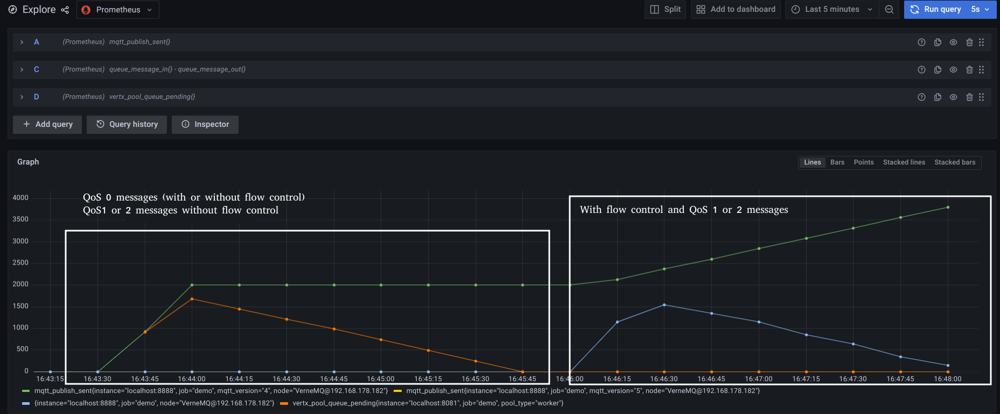

# vertx-mqtt-flowcontrol-example
An example of vertx-mqtt using flown control and QoS 1 or 2 message (with manual ack).

## Introduction

In MQTT you can send messages (and receive it) with a concept called QoS (Quality of Service) level. There are three QoS level:

- 0 At most once delivery
- 1 At least once delivery
- 2 Exactly once delivery

The concept of QoS in MQTT is sometime misunderstood, myself didn't understand why to use a QoS > 0 since MQTT travels over a TLS connection over TCP, so reliable connection. 

The secret is that QoS is not related to connections (http://docs.oasis-open.org/mqtt/mqtt/v3.1.1/errata01/os/mqtt-v3.1.1-errata01-os-complete.html#_Toc442180911) but to Flow Control (yeah a thing that we manage since RS232 or before!).

When you send a QoS 0 message ("fire and forget") you can send messages at the maximum rate of communication channel, but what about who has to manage these messages? If the receiver has to elaborate the messages, maybe it enqueue this messages, and the queue can fill up very quickly, and in this case we lose messages.

MQTT QoS 1 and 2 messages are useful to manage the message flow and avoid client flood. But how? At these QoS level, the sender has to wait an ack (PUBACK for QoS1 and PUBCOMP for QoS2) from the receiver, and it can send a certain number of messages that are not ack'ed.
This parameter, in MQTT 3, is not known for received messages from clients, so you need to know the Broker's configuration (see for example https://docs.vernemq.com/configuring-vernemq/options#inflight-messages for VerneMQ Broker), but it is possible to set this value for sent messages, for example _setMaxInflightQueue(int maxInflightQueue)_ in VertX MQTT Client.

In MQTT 5 each client can tell to the broken the max number of inflight messages using the parameter [Receive Maximum](https://docs.oasis-open.org/mqtt/mqtt/v5.0/os/mqtt-v5.0-os.html#_Toc3901049)  

## VertX implementation

The problem I found in VertX MQTT Client implementation is that acknowleged of the message is done by the library before pass the message to the application logic. So the application do not have the ability to mark the message as elaborated. In this way, MQTT message at QoS1 or QoS2 can be lost before they can be elaborated, for example for a crash of the client, since the broker has received the acks for those messages, the message, for it, are successful delivered.

I extended the message handler of the VertX client and I give the opportunity to application logic to ack the message.

## This example

In this example I setup a test case with metric endpoint enabled, so we can see what happen while receiving message. This the main code:

```
client.connect(1883, "localhost").andThen(ret -> {

			client.publishHandlerManualAck(msg -> {

				vertx.executeBlocking(promise -> {

					System.out.println(Thread.currentThread().getName() + " New message in topic: " + msg.topicName()
							+ " qos: " + msg.qosLevel() + " content: " + msg.payload().toString());

					try {
						Double d = Math.random() * 2500;
						Thread.sleep(d.longValue());
					} catch (InterruptedException e) {
						e.printStackTrace();
					}

					System.out.println(Thread.currentThread().getName() + " Done message: " + msg.payload().toString());
					msg.ack();

				}, false);

			}).subscribe("demo", 2);

		});
```
Let me say that elaborate the message is a CPU intensive task, so I use an executeBlocking method. Receiving a message with the publishHandlerManualAck handled, I have the opportunity to ack the message. I ack all messages, though for QoS 0 messages the function does nothing, but I like to eliminate an "if" on msg.qosLevel().

What happen when this code receive messages it's shown in this image:



In the first case, this client receive a lot of QoS 0 messages, and the queue of worker pool that VertX has to run grow up. In this case a crash of the client translates to a lot of messages (but are QoS 0 messages so it is accepted).

It the second case, the client receive a lot of QoS 1 messages, but, up to max_inflight_message that need to be ack'ed. In this way, the messages on the broker are are removed only after they are elaborated on the client side, and the client is not flood of message (as you can see, the messages are queued on broker, the blue line). This means also that if the client crash, all messages that are not elaborated (also the messages that are in the client queue) can be resend to the client at the next startup (it the client uses the Clean Session flag to false).

## Running this example

To run this example I use docker and started an instance of VerneMQ, Prometheus and Grafana:

```
$ docker run --rm --network host -v //home/dometec/test/prometheus.yml:/etc/prometheus/prometheus.yml --name prometheus prom/prometheus:v2.40.1

$ docker run --rm --name=grafana --network host grafana/grafana:8.5.15

$ docker run --rm --network host -e "DOCKER_VERNEMQ_ACCEPT_EULA=yes" -e "DOCKER_VERNEMQ_ALLOW_ANONYMOUS=on" -e "DOCKER_VERNEMQ_LISTENER__TCP__DEFAULT=0.0.0.0:1883" -e "DOCKER_VERNEMQ_MAX_ONLINE_MESSAGES=10000" -e "DOCKER_VERNEMQ_MAX_OFFLINE_MESSAGES=10000" --name vernemq1 vernemq/vernemq:1.12.6.1
```
You can use the following command to see the active subscription on broker and see how many messages there are on the broker queue:
```
$ docker exec -it vernemq1 vmq-admin session show --client_id --is_online --mountpoint --peer_host --peer_port --user --offline_messages  --online_messages  --clean_session
```
At the end you can start this Verticle:
```
$ mvn exec:java
```
And you can use any other MQTT Client to send message to "demo", for example this is mosquitto_pub that send 10 msg/sec:

```
watch -n 0.1 "mosquitto_pub -d -t 'demo' -q 1 -m "ciao""
```
But I use mqtt spy to reach 100 msg/sec as the number showed on the picture above.


